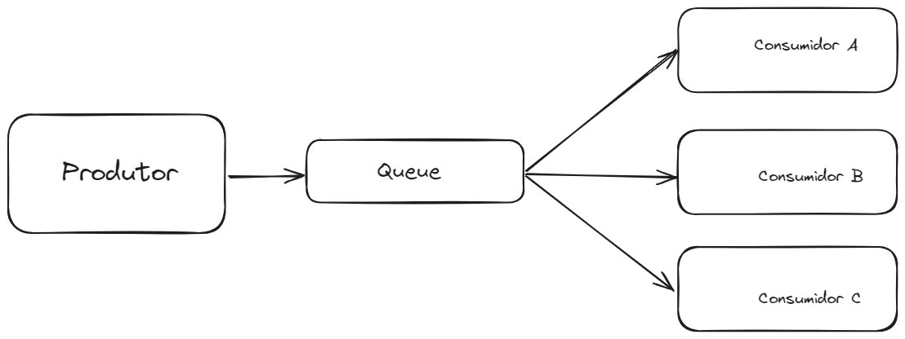
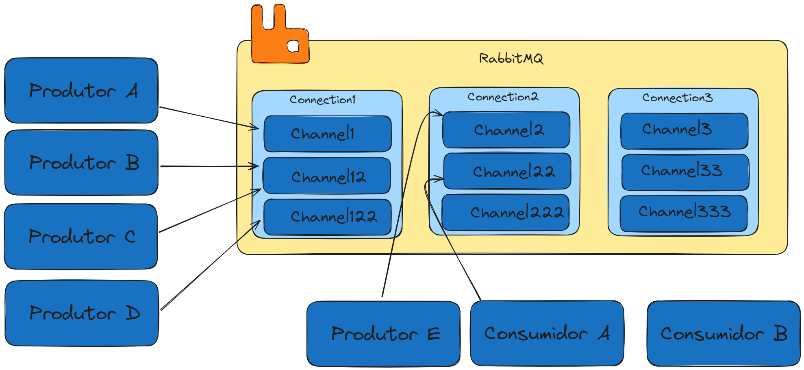
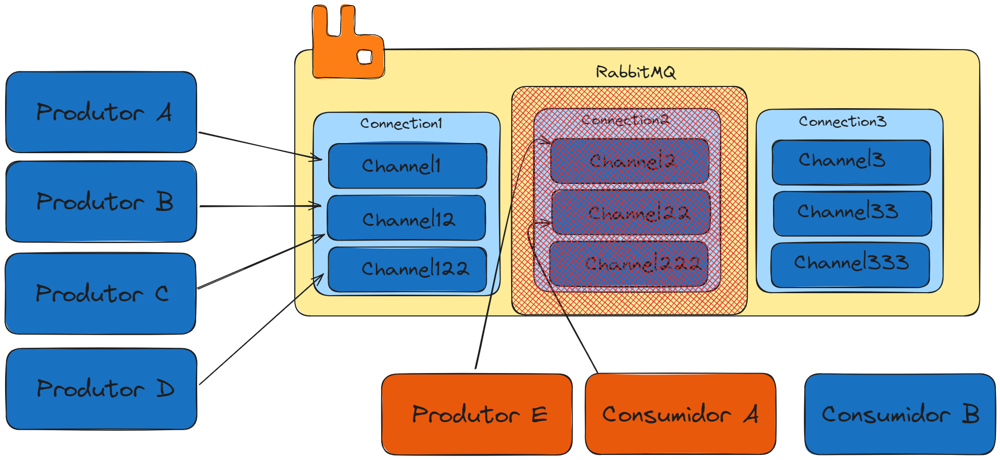
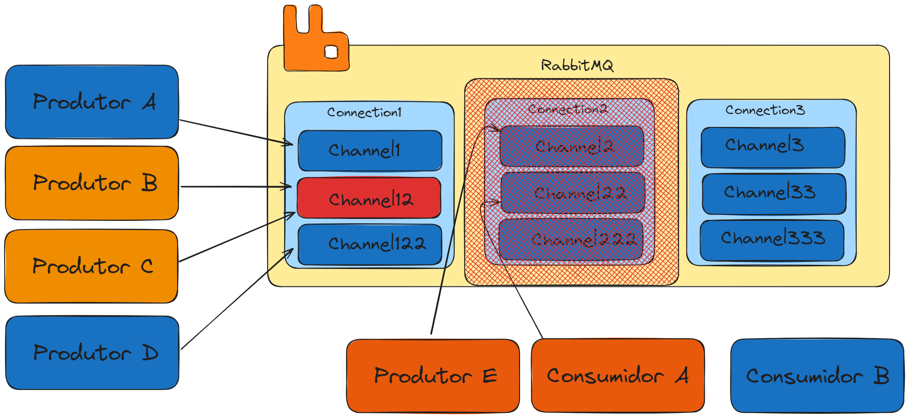
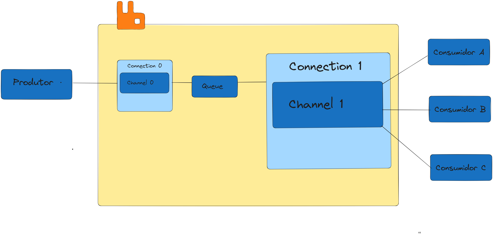
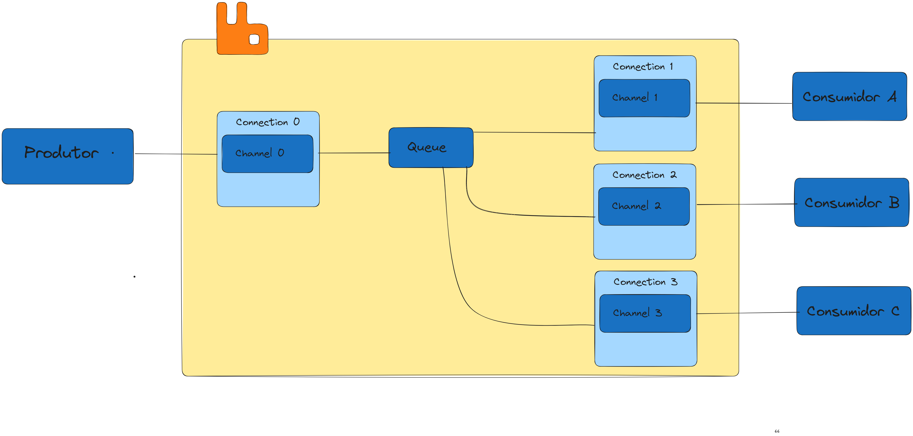
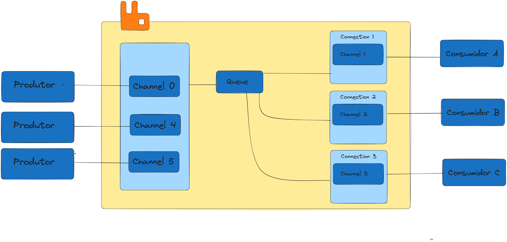

### 1. Conceitos Fundamentais

- **Conexão (Connection)**: Uma sessão TCP aberta com o broker RabbitMQ.
    
- **Channel**: Uma via de comunicação lógica dentro de uma conexão. Normalmente, cada **produtor** precisa de seu próprio channel, enquanto consumidores podem compartilhar ou não um channel (dependendo do cenário).
    
- **Fila (Queue)**: Contém as mensagens enviadas pelos produtores e aguardando o processamento pelos consumidores.
    
- **Balanceamento**: Quando vários consumidores estão associados a uma mesma fila, o RabbitMQ geralmente realiza um **round-robin** para distribuir mensagens.
    
- **Objetivo**: Aumentar ou reduzir a quantidade de canais e consumidores de acordo com a capacidade de produção/consumo.

---

### 2. Ilustrações 



Representação simples de um **Produtor** publicando mensagens em uma fila **ordem** e vários **Consumidores** lendo essas mensagens de forma paralela (work queue).



Exemplo de **duas conexões** no RabbitMQ, cada uma contendo **múltiplos canais**. Cada canal pode estar associado a um produtor distinto ou a um conjunto diferente de consumidores.



Demonstração de **isolamento** entre conexões: caso uma conexão caia, os canais e processos associados a ela são afetados, mas as demais conexões permanecem ativas.



Ilustra **dois produtores tentando usar o mesmo channel**. Esse cenário demonstra o **conflito** que pode ocorrer quando produtores compartilham um único canal, pois ambos competiriam pela publicação, tornando o fluxo menos seguro e previsível. A recomendação é que cada produtor tenha seu **próprio channel**, ainda que possam **compartilhar a mesma conexão**, garantindo isolamento e evitando problemas de concorrência.



Mostra como **vários consumidores** podem compartilhar um único channel ou ter channels próprios – tudo dependendo da estratégia de escalabilidade e isolamento que se queira adotar.



Exemplo de **Produtor e Consumidores em conexões separadas**: o Produtor rodando em uma conexão (com um ou mais channels), enquanto cada consumidor tem sua própria conexão. Isso maximiza o isolamento de falhas.



Arquitetura onde temos **duas conexões** (uma para produtores, outra para consumidores) e, em cada uma, **múltiplos canais** com produtores e consumidores individuais, explorando ao máximo a possibilidade de balanceamento e paralelismo.

---

### 3. Transcrição Simplificada do Conceito

Trechos-chave do que foi discutido:

> (...) Quando você tem uma **capacidade de produção muito maior** do que a capacidade de consumo, é preciso aumentar o número de consumidores (workers). O RabbitMQ gerencia conexões e canais. Você pode ter **uma conexão** e **vários channels** dentro dela, ou **várias conexões**, cada qual com seus channels. Produtores **não** devem compartilhar o mesmo channel, mas podem compartilhar a mesma conexão em channels distintos.  
> Consumidores podem ser mais “livres”: podem compartilhar channel ou usar channels separados.

> Se a conexão cair, todos os channels daquela conexão caem. Porém, se houver outra conexão ativa, essa permanece. Por isso, definir quantas conexões e quantos canais depende da **estratégia de isolamento** e **recursos** disponíveis.  
> É comum abrir **mais** canais para aumentar a taxa de publicação/consumo, mas também é possível **multiplicar conexões** para isolar falhas ou distribuir a carga em vários processos distintos.  
> O round-robin automático do RabbitMQ ajuda a distribuir mensagens entre consumidores de forma equilibrada, mas se desejar um controle mais preciso, pode-se configurar `BasicQos`, requeue em caso de falhas etc.

---

### 4. Exemplo de Código: Consumidor

Abaixo, vemos um código que cria **2 canais** (loop `for k`) a partir de uma única conexão e, dentro de cada canal, inicia **7 consumidores** (loop `for j`). Assim, temos um total de **14 consumidores** lendo da mesma fila `"order"`.

```csharp
using System.Text;
using RabbitMQ.Client;
using RabbitMQ.Client.Events;

namespace Consumidor;

public static class Program
{
    public static async Task Main(string[] args)
    {
        var factory = new ConnectionFactory { HostName = "localhost" };

        // Abre 1 conexão
        using var connection = await factory.CreateConnectionAsync();

        // Exemplo: cria 2 channels (for k)
        for (int k = 0; k < 2; k++)
        {
            var channel = await CreateChannel(connection);

            // Declara a fila "order"
            await channel.QueueDeclareAsync(
                queue: "order",
                durable: false,
                exclusive: false,
                autoDelete: false,
                arguments: null
            );

            // Em cada channel, criamos 7 consumidores (for j)
            for (int j = 0; j < 7; j++)
            {
                var workerName = $"Worker {j + 1}";
                await BuildAndRunWorker(channel, workerName);
            }
        }

        Console.ReadLine();
    }

    public static async Task<IChannel> CreateChannel(this IConnection connection)
        => await connection.CreateChannelAsync();

    public static async Task BuildAndRunWorker(IChannel channel, string workerName)
    {
        var consumer = new AsyncEventingBasicConsumer(channel);

        consumer.ReceivedAsync += (model, ea) =>
        {
            var body = ea.Body.ToArray();
            var message = Encoding.UTF8.GetString(body);

            // ChannelNumber identifica qual canal está atendendo
            Console.WriteLine($"{channel.ChannelNumber} - {workerName}: [x] Received {message}");
            return Task.CompletedTask;
        };

        // Consumindo da mesma fila "order"
        await channel.BasicConsumeAsync(
            queue: "order",
            autoAck: true,
            consumer: consumer
        );

        // Aqui, apenas para manter o processo ativo
        Console.ReadLine();
    }
}
```

**Notas**:

- `autoAck = true` retira as mensagens da fila assim que entregues ao consumidor.
    
- O `Console.ReadLine()` final mantém o programa vivo.
    
- Cada `BuildAndRunWorker` cria um consumidor que fica “escutando” a fila.

---

### 5. Exemplo de Código: Produtor

Aqui, abrimos **uma única conexão** e **dois canais** para publicar mensagens. Cada canal corresponde a um “Produtor” diferente, mas **na mesma fila** `"order"`.

```csharp
using RabbitMQ.Client;
using System.Text;

namespace Produtor;

public static class Program
{
    public static async Task Main(string[] args)
    {
        var factory = new ConnectionFactory { HostName = "localhost" };

        // Abre 1 conexão TCP
        using var connection = await factory.CreateConnectionAsync();

        var queueName = "order";

        // Cria 2 channels a partir dessa conexão
        var channel1 = await CreateChannel(connection);
        var channel2 = await CreateChannel(connection);

        // Associa cada channel a um "Produtor" diferente
        BuildPublishers(channel1, queueName, "Produtor A");
        BuildPublishers(channel2, queueName, "Produtor B");

        Console.ReadLine();
    }

    // Helper para criar channels de forma assíncrona
    public static async Task<IChannel> CreateChannel(this IConnection connection)
        => await connection.CreateChannelAsync();

    // Método que efetivamente publica mensagens em loop
    public static void BuildPublishers(IChannel channel, string queue, string publisherName)
    {
        Task.Run(async () =>
        {
            int count = 0;

            // Declara a fila "order" (se não existir)
            await channel.QueueDeclareAsync(
                queue: queue,
                durable: false,
                exclusive: false,
                autoDelete: false,
                arguments: null
            );

            while (true)
            {
                // Prepara a mensagem
                string message = $"OrderNumber: {count++} from {publisherName}";
                var body = Encoding.UTF8.GetBytes(message);

                // Publica no RabbitMQ
                await channel.BasicPublishAsync(
                    exchange: string.Empty,
                    routingKey: "order",
                    body: body
                );

                // Intervalo de 1 segundo para envio
                Thread.Sleep(1000);
            }
        });
    }
}
```

**Notas**:

- Cada produtor executa dentro de um `Task.Run`, publicando a cada 1 segundo.
    
- Se você quiser adicionar mais produtores, basta criar mais channels ou conexões.

---

### 6. Observações Gerais

1. **Balanceamento**: O RabbitMQ faz round-robin entre consumidores pendurados na **mesma** fila.
    
2. **Conexões**: Cada conexão é mais “cara” de manter do que abrir canais extras. Porém, múltiplas conexões podem isolar falhas.
    
3. **Produtor**: Em geral, **um channel por produtor** é a boa prática. Não colocar vários produtores competindo no mesmo channel.
    
4. **Consumidor**: Pode compartilhar channel ou ter um channel individual, dependendo do volume de mensagens e necessidades de isolamento.
    
5. **Teste de Carga**: Sempre teste quantas conexões e canais o seu sistema e o broker suportam confortavelmente.
    
6. **ACK Manual**: Em produção, convém usar `autoAck = false` e fazer _ack_ somente depois que a mensagem foi processada com sucesso.
    
7. **Durabilidade**: Para evitar perda de mensagens em caso de reinício do RabbitMQ, marque a fila como **durable** e envie mensagens **persistentes**.

---

### 7. Conclusão

Podemos escalar facilmente a quantidade de produtores (aumentando a taxa de publicação) e consumidores (ampliando a capacidade de processamento), aproveitando as características de **multiplicidade** do RabbitMQ. 