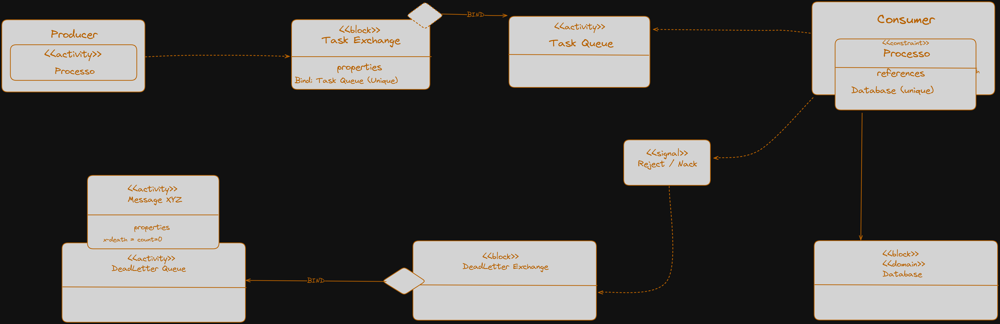

# Estratégia com Dead Letter Queue (DLQ) e uso do campo `arguments`

## Visão Geral

**Dead Letter Queue (DLQ)** é uma estratégia essencial para lidar com mensagens que não podem ser processadas corretamente, evitando que entrem em loop infinito dentro da fila principal e congestionem o sistema. Quando ocorre um erro no consumidor e a mensagem é rejeitada, podemos direcioná-la para uma **fila morta (dead letter queue)** para posterior análise, evitando perda de dados ou comportamento inesperado.

---

## Diagrama



## Por que usar DLQ?

Sem DLQ:

- A mensagem com erro é devolvida para a mesma fila.
    
- O consumidor tenta processá-la novamente, falha, devolve, e isso se repete infinitamente.
    
- Causa **loop de reprocessamento**, consumindo recursos e mascarando problemas.

Com DLQ:

- A mensagem é redirecionada para uma **fila separada de análise**, sem afetar o fluxo principal.

---

## Papel do `arguments`

No RabbitMQ, o parâmetro `arguments` na criação de uma fila permite **adicionar configurações extras**, como:

- Definir para onde a mensagem deve ser redirecionada caso seja rejeitada.
    
- Definir TTL (tempo de vida da mensagem).
    
- Aplicar limite de mensagens ou tamanho da fila.

No caso da DLQ, usamos `arguments` para indicar que, **quando uma mensagem for rejeitada**, ela deve ser encaminhada para um exchange de dead-letter.

```csharp
var arguments = new Dictionary<string, object>
{
    { "x-dead-letter-exchange", "DeadLetterExchange" }
};
```

Esse dicionário é passado na hora de declarar a fila principal:

```csharp
await channel.QueueDeclareAsync(queue: "task_queue",
                     durable: true,
                     exclusive: false,
                     autoDelete: false,
                     arguments: arguments);
```

---

## Funcionamento completo com DLQ

### Criar o Exchange de DLQ

```csharp
await channel.ExchangeDeclareAsync("DeadLetterExchange", ExchangeType.Fanout);
```

> Tipo Fanout: entrega todas as mensagens para todas as filas vinculadas (ideal para centralizar DLQs).

---

### Criar a Fila de DLQ

```csharp
await channel.QueueDeclareAsync("DeadLetterQueue", durable: true, exclusive: false, autoDelete: false);
```

---

### Vincular Exchange DLQ à Fila DLQ

```csharp
await channel.QueueBindAsync("DeadLetterQueue", "DeadLetterExchange", routingKey: "");
```

---

### Declarar a fila principal com argumento de DLQ

```csharp
var arguments = new Dictionary<string, object>
{
    { "x-dead-letter-exchange", "DeadLetterExchange" }
};

await channel.QueueDeclareAsync(queue: "task_queue",
                     durable: true,
                     exclusive: false,
                     autoDelete: false,
                     arguments: arguments);
```

> Quando uma mensagem for **rejeitada com `requeue = false`**, ela será automaticamente enviada ao **DeadLetterExchange**, que a encaminhará à `DeadLetterQueue`.

---

## Código do Consumidor com tratamento de erro

```csharp
var consumer = new AsyncEventingBasicConsumer(channel);

consumer.ReceivedAsync += async (model, ea) =>
{
    var body = ea.Body.ToArray();
    var message = Encoding.UTF8.GetString(body);

    try
    {
        int valor = int.Parse(message);
        Console.WriteLine($" [✔] Recebido e processado: {valor}");

        await channel.BasicAckAsync(ea.DeliveryTag, multiple: false);
    }
    catch (Exception ex)
    {
        Console.WriteLine($" [✖] Erro ao processar '{message}'. Enviando para DLQ.");

        await channel.BasicNackAsync(ea.DeliveryTag, multiple: false, requeue: false);
    }
};
```

---

## Resultado prático

1. Mensagens numéricas (ex: `"123"`) são processadas corretamente.
    
2. Mensagens inválidas (ex: `"abc"`) são redirecionadas à fila `DeadLetterQueue`.
    
3. Fila principal permanece limpa e a mensagem problemática pode ser analisada separadamente.

---

## Análise Manual e Estratégias Avançadas

- O RabbitMQ armazena informações de redirecionamento no **header `x-death`**, que pode ser usado para implementar retry limitado.
    
- Ferramentas como o plugin **Shovel** permitem mover mensagens entre filas manualmente.
    
- É possível implementar lógica que tenta reprocessar mensagens da DLQ se não excederem um número de tentativas.
